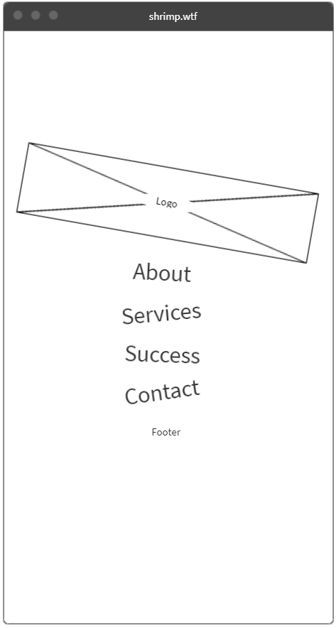
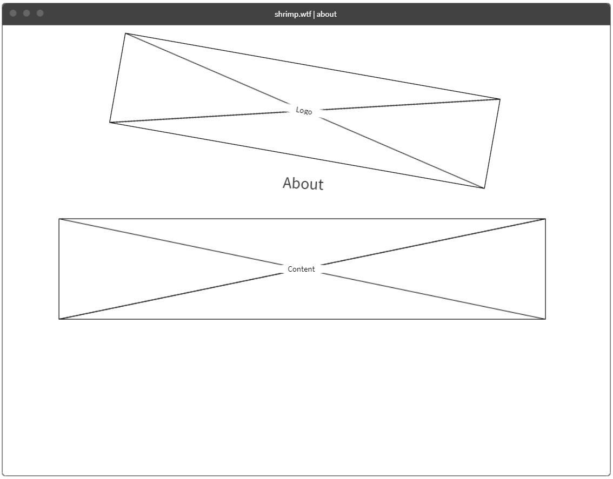
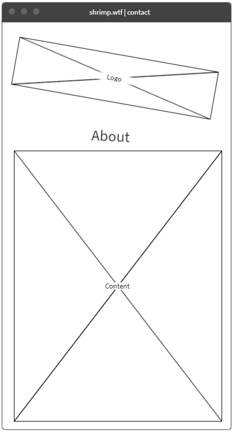
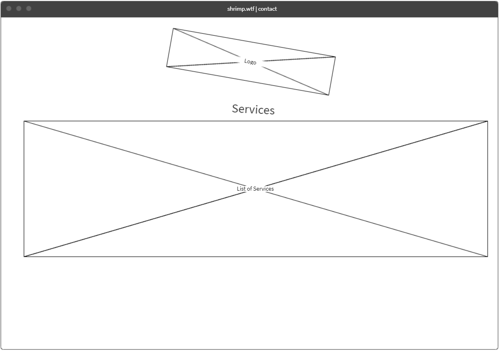
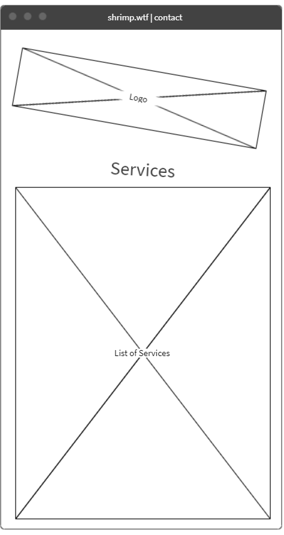
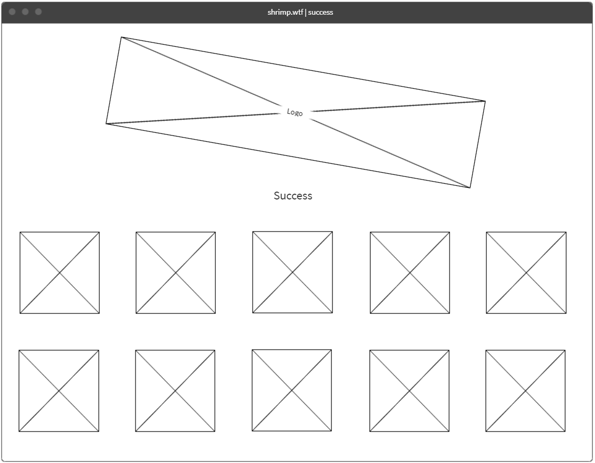
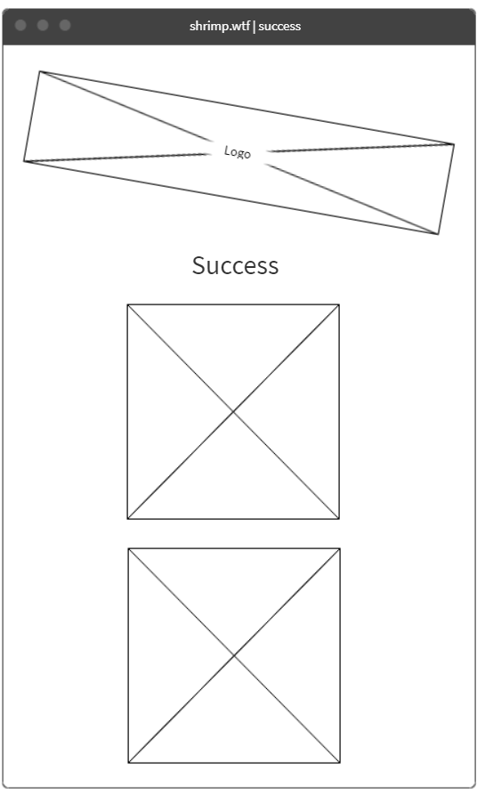
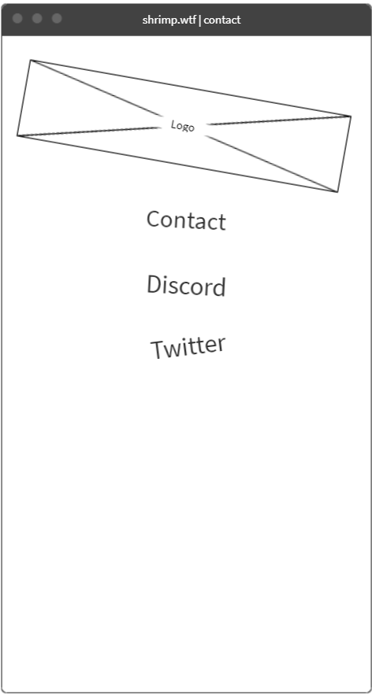

# 1.1 Documentation
## 1.1.1 Background
The assessment brief required creation of a responsive website to solve a real world problem. I have been reselling sneakers for a while and offer services to do with getting hold of limited clothing and collectables. I wanted a website to promote my business and to advertise the services I have to offer, in particular the 'add-to-cart' service. I already had the name 'shrimp' and decided to use that as the brand name for the website. I had some ideas as I had been considering creating a website for some time.
## 1.1.2 Wire Frames
Before I started to create my website, I produced low fidelity wire frames for desktop and mobile for all of my pages. I had a clear image in my mind of how I wanted the site to look. This helped me by having a reference to look to whilst making the website and to know what standard to build it to.

## 1.1.3 Colour Choices
For the website, I went for a light grey background with a tiled "WTF" in a light 'shrimp' pink. I used grey instead of white so it was easier on the eye. I found that using white in the background was too clashy and bright. For the main "shrimp.wtf" logo, I chose a deep 'shrimp' red to boldly stand out. For the menu text, I chose a gradient pink to red to add interest and colour coordinate. For the main text I chose black so you could easily read it as it had good contrast against the grey background. 
## 1.1.4 Accessibility
I was not familiar with the W3C standards so to conform with them I had to do some research. I checked my website against the WCAG 2.1 accessibility checklist which has 3 levels of conformity; Level A, Level AA and Level AAA. My website conforms with Level A and partially Level AA. I then used the website [w3](https://www.w3.org) which had a useful accessibility statement generator that I was able to modify and use to generate my own accessibility statement.
## 1.1.5 GDPR
I was not familiar with GDPR and so had to do some research again. To conform to the General Data Protection Regulation, I checked the [ico](https://ico.org.uk) website to understand the requirements. I then used the Shopify privacy policy generator to create and modify my own privacy policy that conforms to the 8 individual rights.
## 1.1.6 Distance Selling
TI was not familiar with the Distance Selling Act and so had to do more research to conform. I checked the requirements on [gov](https://www.gov.uk/online-and-distance-selling-for-businesses) and also on [lawdonut](https://lawdonut.co.uk). I needed to create a terms of service that conformed but my type of business; add to cart. It was hard to see how distance selling would apply to this scenario so I did research into similar companies also selling the same service. I based my terms of service on what I found but tailored it to my business.
## 1.1.7 Evaluation
I set out to create a responsive website to promote my 'add-to-cart' business under the name 'shrimp.wtf'. I already had some ideas of how I wanted the website to look but had never had time to create it. This assessment gave me the chance to solve this 'real-life' problem by creating live website to start generating income and grow my business which I hope to expand. Producing the wireframes helped me to keep focused on my design and not go off in a different direction. 
The design process started with a blank canvas. I started by making the background which was a grey background image containing "wtf" in light pink. I knew I would be able to tile the image using CSS since I've used CSS before. I then wanted to display the logo, but I didn't want it to be boring so wanted text and images to animate in. This is when I found a Javascript library called "Anime" which allowed me to chain together animations and was really easy to use and created advanced Javascript effects after reading their documentation. By using this I've shown an high level of understanding of Javascript and HTML.
The finished website is exactly how I imagined it to look and performs in the way that I wanted. The website is creative, unique and I beleive it's of a high quality. I am very happy with the finished website but before I make it live I need to expand my servers and proxies to be able to support more customers. For the meantime I will offer this service to friends and family via website.
The biggest problem I had was with CSS as I could not get things to appear in the way I wanted to, for example, centering and adpating to different screen sizes. I created a breakpoint at 800 pixels but the main issue was that I was not using viewport with a scale which messed up the device scaling. I created the website using HTML, CSS and JavaScript which I am very familiar with since I had made various websites in the past, but I had never used viewport before which is why I had problems with it.
The other big problem I had was the conforming with GDPR, Distance Selling Act and W3C accessibility standards. I was not familiar with any of these and had to do a lot of research to understand them. It was really helpful that the Shopify had a privacy policy generator that I was able to use and modify and that W3 had an accessibility policy generator I could use and modify. If I had to create them from scratch I think I would have struggled. The Terms of Service was very hard to create as the 'add-to-cart' business was quite unique and I struggled to understand how to conform with the Distance Selling Act. Luckily there were some websites offering similar services and I was able to create my own one using those as a basis.
To test the website on multiple devices I used the Chrome Developer tools to emulate various phone environments, but initially it was off-centre and not scaled properly even though I thought had shrunk it correctly with the breakpoint. I found this very frustrating as I did not know how to correct it straight away. I did some research and found a forum where another user had the same issue and the solution was to use viewports. Once I had added the viewport, the issue resolved and I was able to test the website on various phones using the Chrome Developer tool.
I wanted the website to be different, fun and interesting, while still looking professional. I used a JavaScript library called anime to add advanced JavaScript animations to elements on the page to animate in and hover effects. The target market is ages 13-25 and so the design and brand name is aimed at that market. The 'WTF' will be seen as cool by my target market and they will not be offended by it. 
Overall I am very pleased with how the website has turned out and it is exactly how I envisioned it to be. I beleive that I have met all of the assessment criteria to a high standard by creating a responsive website containing JavaScript funcionality that provides animations and liven up the website.
## 1.1.8 References
ACCESSW3, 2019. WCAG 2.1 Accessibility Checklist [viewed 5 May 2019]. Available from: http://accessw3.com/wcag21-accessibility-checklist.html

ANIMEJS, 2019. AnimeJS Documentation [viewed 9 May 2019]. Available from: https://animejs.com/documentation/

DIGITAL.COM, 2019. QUICK &amp; EASY PRIVACY POLICIES: THE 12 BIGGER GENERATORS RANKED [viewed 5 May 2019]. Available from: https://digital.com/blog/best-privacy-policy-generators/

GDPR.EU, 2019. Our Company Privacy Policy [viewed 5 May 2019]. Available from: https://gdpr.eu/wp-content/uploads/2019/01/Our-Company-Privacy-Policy.pdf

GOV.UK, 2019. Online and distance selling [viewed 5 May 2019]. Available from: https://www.gov.uk/online-and-distance-selling-for-businesses

ICO, 2019a. Guide to the General Data Protection Regulation (GDPR) [viewed 5 May 2019]. Available from: https://ico.org.uk/for-organisations/guide-to-data-protection/guide-to-the-general-data-protection-regulation-gdpr/

ICO, 2019b. Individual rights [viewed 5 May 2019]. Available from: https://ico.org.uk/for-organisations/guide-to-data-protection/guide-to-the-general-data-protection-regulation-gdpr/individual-rights/

LAWDONUT, 2019. Distance selling - what the law says [viewed 5 May 2019]. Available from: https://www.lawdonut.co.uk/business/marketing-and-selling/distance-and-online-selling/distance-selling-what-the-law-says

SHOPIFY, 2019. Privacy policy template for your website [viewed 5 May 2019]. Available from: https://www.shopify.com/tools/policy-generator

STACKOVERFLOW, 2019. How to center div element in mobile devices by CSS media queries [viewed 9 May 2019]. Available from: https://stackoverflow.com/questions/46517111/how-to-center-div-element-in-mobile-devices-by-css-media-queries

W3C, 2019a. Generate an Accessibility Statement [viewed 2 May 2019]. Available from: https://www.w3.org/WAI/planning/statements/generator/#preview

W3C, 2019b. How to Meet WCAG 2 (Quick Reference) [viewed 5 May 2019]. Available from: https://www.w3.org/WAI/WCAG21/quickref/?currentsidebar=%23col_customize&showtechniques=241

WEBAIM, 2019. WCAG 2 Checklist [viewed 5 May 2019]. Available from: https://webaim.org/standards/wcag/WCAG2Checklist.pdf